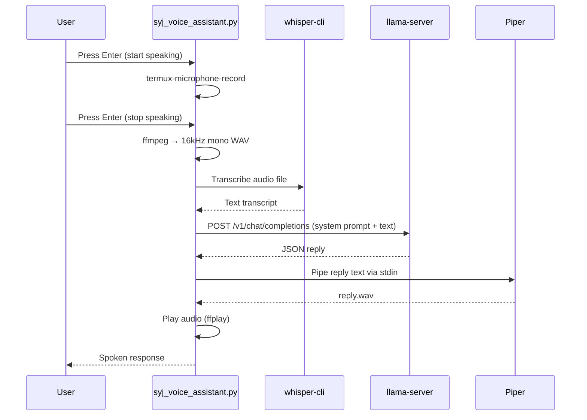

# SYJ Voice Assistant

A fully local, offline voice assistant for Android — built to run entirely inside Termux with no cloud dependency.

Speech-to-text, language model, and text-to-speech all run on-device. Nothing leaves the phone.

---

## Architecture


## Runtime Flow



---

## Features

- 🎤 Push-to-talk microphone capture via Termux:API — no unreliable silence detection, no missed words
- 📝 Offline speech recognition with whisper.cpp (`whisper-cli`)
- 🤖 Fully local LLM via llama.cpp's `llama-server`, no Ollama or cloud API
- 🔊 Offline text-to-speech with Piper
- 📱 Designed and tested for Android Termux, zero cloud dependency
- 🔍 Auto-detects binaries and models at startup, with a clear status report instead of silent failures

---

## Requirements

| Component | Purpose | Status |
|---|---|---|
| [Termux](https://termux.dev) + [Termux:API](https://wiki.termux.com/wiki/Termux:API) | Shell environment + microphone access | ✅ |
| FFmpeg | Audio format conversion | ✅ |
| [whisper.cpp](https://github.com/ggerganov/whisper.cpp) (`whisper-cli`) | Speech-to-text | ✅ |
| Whisper GGML model (e.g. `ggml-base.en.bin`) | Speech-to-text model weights | ✅ |
| [llama.cpp](https://github.com/ggerganov/llama.cpp) (`llama-server`) | Local LLM inference server | ⬜ |
| GGUF model (e.g. Llama 3 8B Instruct, quantized) | LLM weights | ⬜ |
| [Piper](https://github.com/rhasspy/piper) | Text-to-speech | ⬜ |
| Piper voice model (`.onnx` + `.onnx.json`) | TTS voice | ⬜ |

Update the checkboxes above as you complete setup on your device.

---

## Installation

```bash
# Core tools
pkg install termux-api ffmpeg git python

# Install the Termux:API companion app from F-Droid or Google Play as well —
# the pkg above only installs the CLI bridge, not the Android app itself.
```

**whisper.cpp** — build with CMake, place a GGML model under `~/whisper.cpp/models/`.

**llama.cpp** — build `llama-server`, place a GGUF model under `~/llama.cpp/models/`.

**Piper** — download an aarch64 release binary and a voice model (`.onnx` + `.onnx.json`), place under `~/piper/`.

The script auto-detects all of the above from common install locations at startup and reports exactly what's missing if anything isn't found.

---

## Usage

**1. Start the local LLM server** in its own Termux session (keep it alive with `tmux`/`screen` + `termux-wake-lock`, since Android will kill a backgrounded single session):

```bash
llama-server -m ~/llama.cpp/models/<your-model>.gguf -c 4096 --port 8080
```

**2. Run the assistant** in a second session:

```bash
python syj_voice_assistant.py
```

The script prints a component status table on startup and will refuse to start the conversation loop until everything required is in place.

---

## Configuration

The persona is set via a system prompt at the top of `syj_voice_assistant.py`:

```python
SYSTEM_PROMPT = (
    "You are a helpful, witty, and concise personal assistant for Syed Ali Hasan. "
    "You are efficient and always ready to help."
)
```

Binary and model paths are auto-detected but can be overridden directly in the config section of the script if your install locations differ from the defaults.

---

## Why push-to-talk instead of silence detection?

Termux has no raw ALSA/PulseAudio microphone device, so amplitude-based voice activity detection isn't reliable in this environment. Press Enter to start recording, Enter again to stop — deliberate design choice, not a limitation of the pipeline.

## Why llama-server instead of a CLI call per turn?

Reloading a multi-GB GGUF model on every single question would make each reply take minutes on phone hardware. `llama-server` loads the model once and answers over HTTP, the same pattern used by tools like Ollama — just fully self-hosted.

---

## Project Structure

```
Syj-Voice-Asistant/
├── syj_voice_assistant.py   # Main orchestrator script
├── README.md
├── LICENSE
└── .gitignore
```

---

## Author

**Syed Ali Hasan Moosavi**
Founder & Managing Director, SAYANJALI NEXUS PRIVATE LIMITED

## License

See [LICENSE](./LICENSE).
